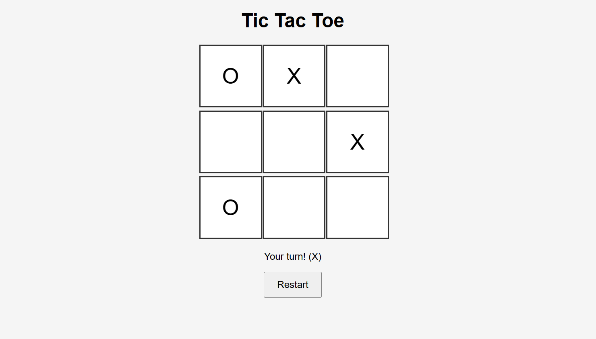

# Tic Tac Toe with AI

A classic game where you play against an unbeatable AI opponent using the Minimax algorithm.

## How to Run the Game

1. **Download the files**: Ensure you have all the game files in the correct folder structure:

   - `index.html` (main file)
   - `style.css` (styling)
   - `script.js` (game logic and AI implementation)

2. **Open the HTML file**: Double-click on `index.html` to open it in your web browser

3. **Start playing**: The game will load automatically and you can start playing immediately

## Prerequisites

**No installation required!** This game runs entirely in your web browser using:

- **HTML5** for the structure
- **CSS3** for styling and animations
- **Vanilla JavaScript** for game logic and AI

**Browser Requirements:**

- Any modern web browser (Chrome, Firefox, Safari, Edge)
- JavaScript enabled (enabled by default in most browsers)

## How to Play

1. **Make Your Move**: You play as "X" - click on any empty cell to place your mark
2. **AI Response**: The computer plays as "O" and will automatically make its move after you
3. **Win Condition**: Get three of your marks in a row (horizontal, vertical, or diagonal) to win
4. **Restart**: Click the Restart button at any time to start a new game

**Controls:**

- **Mouse Click**: Click on empty cells to make moves
- **Restart Button**: Start a new game at any time

## Algorithms Used

This game implements several important algorithms and programming concepts:

1. **Minimax Algorithm**:

   - **Purpose**: Ensures the AI makes optimal moves
   - **How it works**: Recursively evaluates all possible future game states
   - **Result**: The AI is unbeatable - the best you can achieve is a draw
   - **Time Complexity**: O(b^d) where b is branching factor (available moves) and d is depth (remaining moves)

2. **Game Tree Search**:

   - **Depth-First Search**: Explores game states recursively
   - **Backtracking**: Undoes moves to explore other possibilities
   - **Scoring System**: Evaluates game states with positive scores for AI wins, negative scores for human wins

3. **Game State Management**:

   - **State Representation**: 1D array representing the 3x3 board
   - **Win Detection**: Pattern matching against winning combinations
   - **Turn Management**: Alternates between human and AI players

4. **Event-Driven Programming**:
   - **DOM Event Handling**: Responds to user clicks
   - **Dynamic Rendering**: Updates UI based on game state changes
   - **Async Operations**: Simulates "thinking time" for the AI

## Key Features

- **Clean Interface**: Simple, intuitive design with clear visual feedback
- **Unbeatable AI**: Perfect play from the AI using the minimax algorithm
- **Interactive Grid**: Responsive 3x3 board with hover effects
- **Game Status**: Real-time feedback on game state and turn information
- **Modern Styling**: Attractive visual design with animations and effects

## Implementation Details

The game is built with three main components:

1. **HTML Structure**: Provides the basic layout of the game
2. **CSS Styling**: Creates an attractive, responsive interface
3. **JavaScript Logic**:
   - Game board rendering and state management
   - Player move handling and validation
   - AI move calculation using minimax
   - Win/draw detection

### Minimax Algorithm Explained

The AI uses the minimax algorithm to determine the best move. Here's a simplified explanation:

1. The AI simulates all possible moves it can make
2. For each move, it simulates all possible player responses
3. This continues recursively until reaching terminal states (win, loss, draw)
4. Terminal states are assigned scores: +10 for AI win, -10 for player win, 0 for draw
5. The AI chooses the move with the highest score, assuming the player will make optimal moves

This approach makes the AI unbeatable. The best outcome a human player can achieve is a draw.

---

**For detailed implementation guide and code explanations, see [Detailed_Guide.md](Detailed_Guide.md)**
  
## Why the AI is Unbeatable

The minimax algorithm explores all possible future moves and outcomes, essentially "looking ahead" to the end of the game. For a simple game like Tic-tac-toe with a limited number of possible states, this means the AI can always choose the optimal move.

The best a human player can achieve against this AI is a tie, which happens when both players make optimal moves.

## Taking It Further

To better understand the code, try:
1. Following the flow of a game step-by-step
2. Adding `console.log()` statements to see how values change
3. Modifying the AI's difficulty by limiting the minimax depth
